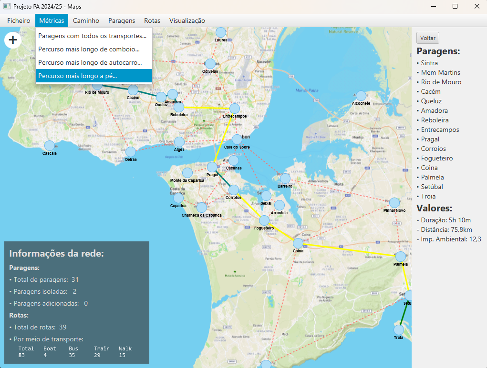

# Transit Network Visualizer & Route Optimizer
A JavaFX application for managing and analyzing public transportation networks with pathfinding and interactive graph visualization.

## Features

### Network Management
- **Stop Management**: Add, remove, and edit transit stops with geographic coordinates
- **Route Configuration**: Create and manage connections between stops with multiple transport modes
- **Transport Modes**: Support for various transportation types (bus, train, boat, etc.) with color-coded visualization
- **Dynamic Network**: Enable/disable specific transport connections between stops

### Route Planning & Analysis
- **Multi-Criteria Pathfinding**: Find optimal routes based on:
  - Distance optimization
  - Travel time minimization
  - Environmental impact reduction
- **Network Statistics**: Calculate shortest and longest paths across the entire network
- **Comprehensive Stop Info**: View all available transport options at any given stop

### User Experience
- **Interactive Map Visualization**: Multiple view modes (normal, satellite, map, dark)
- **Coordinate Mapping**: Automatic screen position calculation from geographic coordinates
- **Undo/Redo System**: Complete action history with undo capabilities
- **Import/Export**: JSON-based file format for network persistence

### Architecture & Design Patterns
Built with software engineering good practices including:
- **MVC Architecture**: Clean separation of concerns
- **Strategy Pattern**: Flexible pathfinding algorithms
- **Factory Pattern**: Extensible component creation
- **Observer Pattern**: Reactive UI update
...

## Tech Stack

### Dependencies
- **JUnit 5.8.1**: Unit testing framework
- **SmartGraph 2.0.0**: Graph visualization library
- **GSON 2.11.0**: JSON serialization/deserialization

### Requirements
- **JDK**: BellSoft Liberica JDK 17 LTS (FULL) with JavaFX support
- Download: https://bell-sw.com/pages/downloads/#/java-17-lts

## Getting Started
1. Ensure you have the correct JDK installed (see requirements above)
2. Clone the repository
3. Build with Maven to resolve dependencies
4. Run the `main` method to launch the application

## Credits
Built with [SmartGraph](https://github.com/brunomnsilva/JavaFXSmartGraph) - an excellent JavaFX graph visualization library by Bruno Silva.

---

*Originally developed as an academic project, now stored as a personal portfolio piece showcasing graph algorithms, design patterns, and Java development.*
